# Comptage de clics avec Kafka Streams et Spring Boot

## Description de l'architecture

Cette application met en place une architecture orientée événements permettant de compter en temps réel les clics des utilisateurs. Elle est composée de trois applications indépendantes qui communiquent via Kafka :

1. **`click-producer-web`** (Spring Boot) — expose une page web avec un bouton. Chaque clic envoie un événement dans le topic Kafka `clicks`, avec l'identifiant de l'utilisateur (`userId`, saisi ou généré dynamiquement côté navigateur) comme clé et `"click"` comme valeur.

2. **`click-streams-app`** (Kafka Streams) — consomme les événements du topic `clicks` et calcule deux comptages en parallèle :
   - un **comptage global** (tous les clics confondus, publié avec la clé `"total"`) ;
   - un **comptage par utilisateur** (publié avec la clé correspondant à chaque `userId`).
   Les deux résultats sont publiés dans le topic `click-counts`.

3. **`click-rest-consumer`** (Spring Boot) — consomme en continu le topic `click-counts` via `@KafkaListener`, distingue les messages grâce à leur **clé Kafka** (`"total"` vs `userId`), garde les valeurs en mémoire, et les expose via une API REST :
   - `GET /clicks/count` => comptage global ;
   - `GET /clicks/count/by-user` => comptage par utilisateur.

### Schéma du flux de données

```
[Navigateur] --clic--> [click-producer-web:8080] --topic clicks--> [click-streams-app]
                                                                          |
                                                                    (comptage total + par user)
                                                                          |
                                                                          v
                                                                  topic click-counts
                                                                          |
                                                                          v
                                                            [click-rest-consumer:8081]
                                                                          |
                                                                          v
                                                        GET /clicks/count(-/by-user)
```

Les trois applications, ainsi que le broker Kafka, sont orchestrées ensemble via `docker-compose.yml`.

---

## Code source

Le code source des trois applications se trouve dans les dossiers :
- `click-producer-web/`
- `click-streams-app/`
- `click-rest-consumer/`

Chaque dossier contient son propre `pom.xml` et son propre `Dockerfile-java`.

---

## Création des topics Kafka

```bash
kafka-topics.sh --create \
--topic clicks \
--bootstrap-server localhost:9092 \
--partitions 1 \
--replication-factor 1
```

```bash
kafka-topics.sh --create \
--topic click-counts \
--bootstrap-server localhost:9092 \
--partitions 1 \
--replication-factor 1
```

---

## Lancement des applications

### Producteur web (Spring Boot)
```bash
mvn clean spring-boot:run
```

### Application Kafka Streams
```bash
mvn clean compile exec:java
```

### Consommateur REST (Spring Boot)
```bash
mvn clean spring-boot:run
```

### Envoyer des messages manuellement pour tester (optionnel)
```bash
kafka-console-producer.sh \
--topic clicks \
--bootstrap-server 0.0.0.0:9092
```

### Consommer le topic de résultats
```bash
./bin/kafka-console-consumer.sh --topic click-counts --bootstrap-server localhost:9092 --from-beginning
```

---

## Captures d'écran

### Démarrage de l'application Spring Boot (producteur)
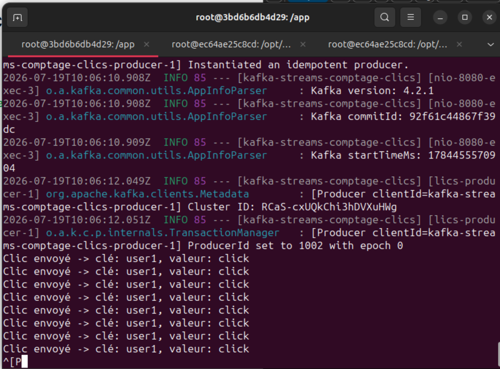

### Interface web — bouton de clic (localhost:8080)
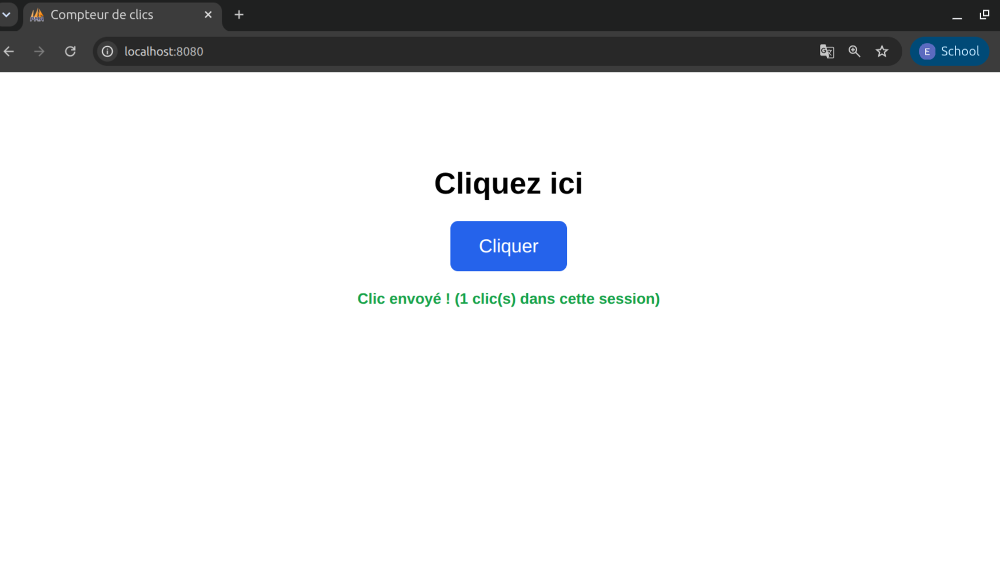
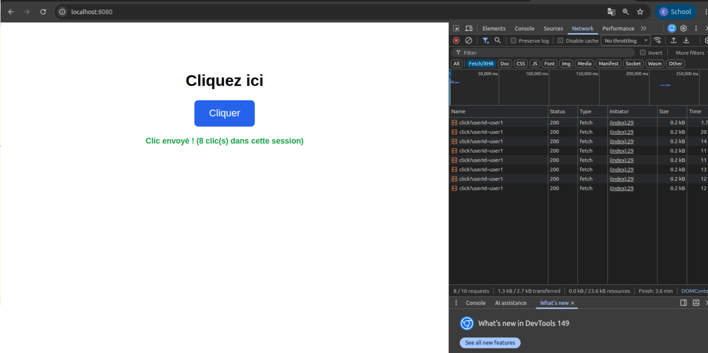

### Traitement côté application Kafka Streams
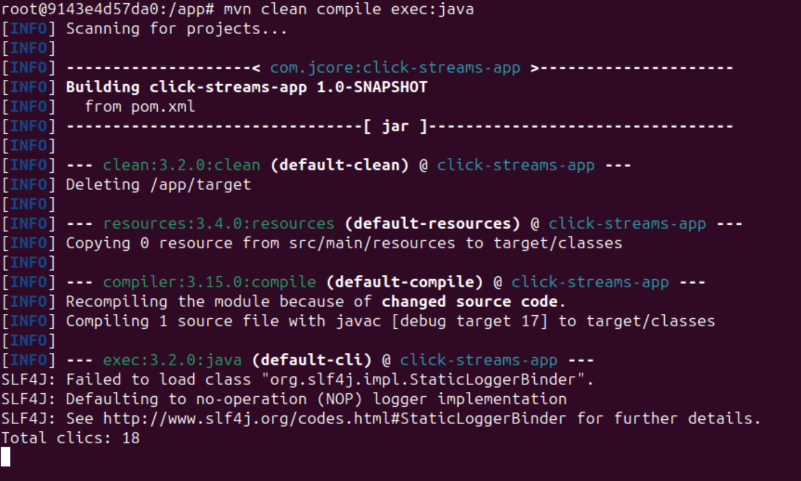

### Messages consommés depuis le topic `click-counts`
```bash
./bin/kafka-console-consumer.sh --topic click-counts --bootstrap-server localhost:9092 --from-beginning
```
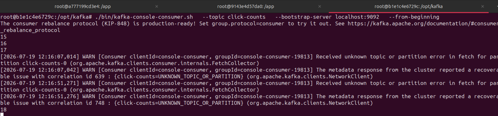

### Scénario de test complet

Interface web après plusieurs clics :
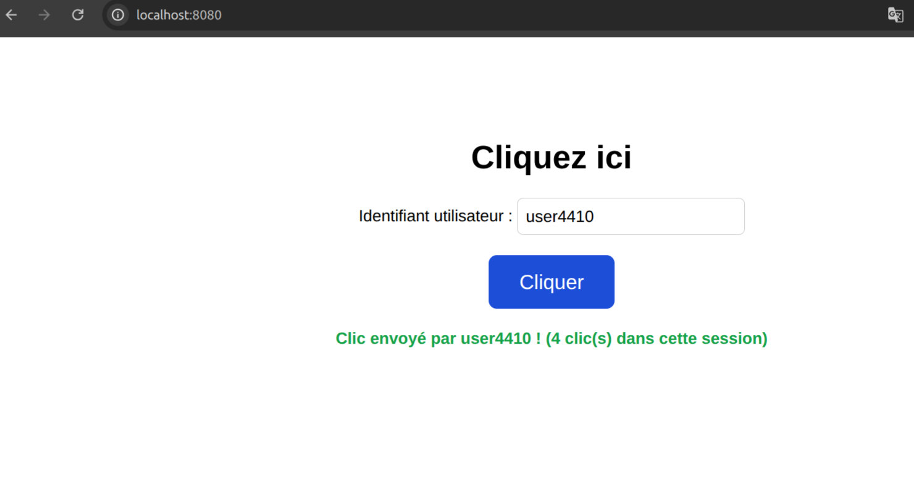

Logs du producteur Spring Boot :
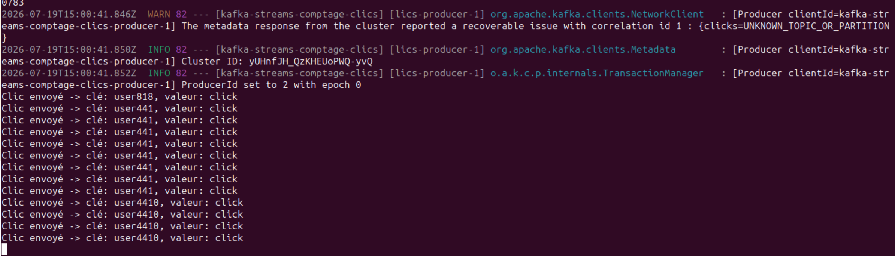

Logs de l'application Kafka Streams :
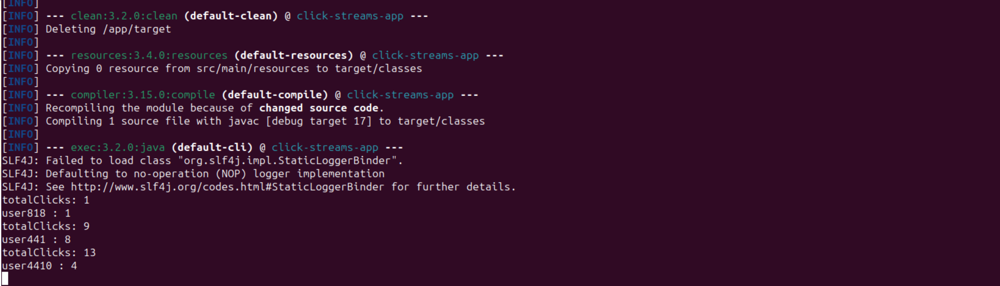

Logs du consommateur REST recevant les mises à jour de `click-counts` :
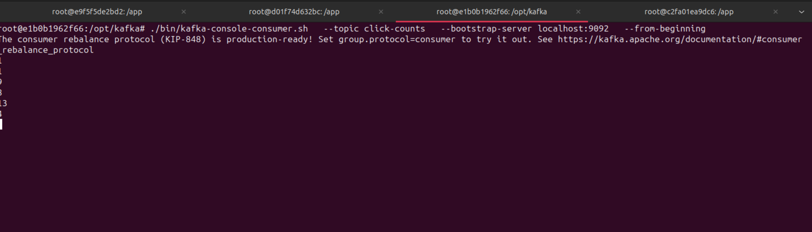

### API REST fonctionnelle

Résultat de `GET /clicks/count/by-user` :
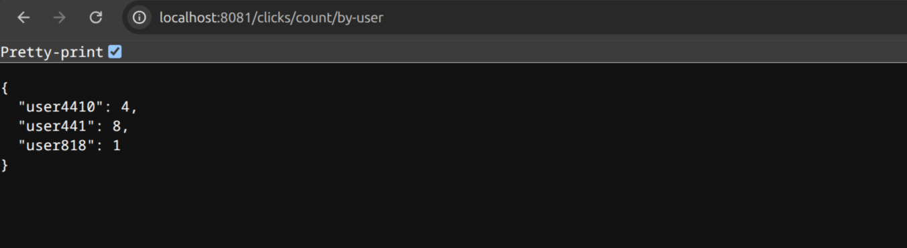

Résultat de `GET /clicks/count` :
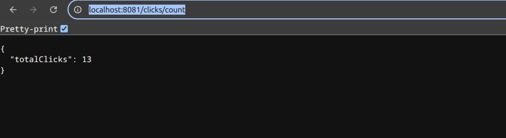

---

## Difficultés rencontrées et solutions

**1. `advertised.listeners` mal configuré dans Kafka**
En environnement Docker, le broker annonçait `localhost:9092` aux clients au lieu du nom de service Docker. Résultat : les applications se connectaient une première fois avec succès, puis échouaient silencieusement sur les requêtes suivantes (blocage sans erreur explicite).
=> Solution : configurer `advertised.listeners=PLAINTEXT://kafka:9092` dans `server.properties`, pour que l'adresse annoncée corresponde au nom du service utilisé dans le réseau Docker Compose.

**2. Incompatibilité de version Java (class file version)**
L'application était compilée avec un JDK plus récent (Java 23) que celui utilisé pour l'exécuter via Maven ou dans le conteneur Docker (Java 17), provoquant une erreur `class file version 67.0 ... this version of the Java Runtime only recognizes class file versions up to 61.0`.
=> Solution : aligner explicitement `maven.compiler.source`/`target` sur la version de Java réellement disponible dans l'environnement d'exécution (17), plutôt que de laisser IntelliJ utiliser le JDK local par défaut.

**3. Topologie Kafka Streams incomplète**
`builder.build()` avait été appelé avant que toutes les étapes du pipeline (filtrage, agrégation, publication) ne soient définies, ce qui figeait une topologie tronquée. Résultat : l'application démarrait sans erreur mais ne traitait presque rien.
=> Solution : toujours définir l'intégralité du pipeline sur le `StreamsBuilder` avant d'appeler `builder.build()`, une seule fois, juste avant la création de `KafkaStreams`.

**4. Application qui s'arrête immédiatement (`exit code 0`)**
Sans mécanisme de blocage, `main()` se terminait juste après `streams.start()`, ce qui empêchait le traitement continu des messages.
=> Solution : ajout d'un `CountDownLatch` associé à un `Runtime.getRuntime().addShutdownHook(...)`, garantissant un arrêt propre et une exécution continue de l'application.

**5. `spring-kafka` insuffisant avec Spring Boot 4.x**
Avec Spring Boot 4, la simple présence de `spring-kafka` dans les dépendances ne suffisait plus à activer l'auto-configuration : le bean `KafkaTemplate` restait introuvable au démarrage (`NoSuchBeanDefinitionException`).
=> Solution : remplacer la dépendance par le starter officiel `spring-boot-starter-kafka`, requis par cette nouvelle version pour activer correctement l'auto-configuration Kafka.

**6. Distinction entre comptage global et comptage par utilisateur**
Le topic `click-counts` contient les deux types de résultats mélangés. Il fallait un moyen de les différencier côté consommateur REST.
=> Solution : utiliser la **clé Kafka** de chaque message (`"total"` pour le comptage global, `userId` pour le comptage individuel) afin de router chaque valeur reçue vers la bonne structure de données, en lisant le message via `ConsumerRecord<String, String>` plutôt que juste sa valeur.

**7. Réinitialisation des données pour retester**
Pour repartir d'un état propre entre deux tests, il fallait supprimer et recréer les topics :
```bash
./bin/kafka-topics.sh --bootstrap-server localhost:9092 --delete --topic clicks
./bin/kafka-topics.sh --bootstrap-server localhost:9092 --delete --topic click-counts

./bin/kafka-topics.sh --bootstrap-server localhost:9092 --create --topic clicks --partitions 1 --replication-factor 1
./bin/kafka-topics.sh --bootstrap-server localhost:9092 --create --topic click-counts --partitions 1 --replication-factor 1
```